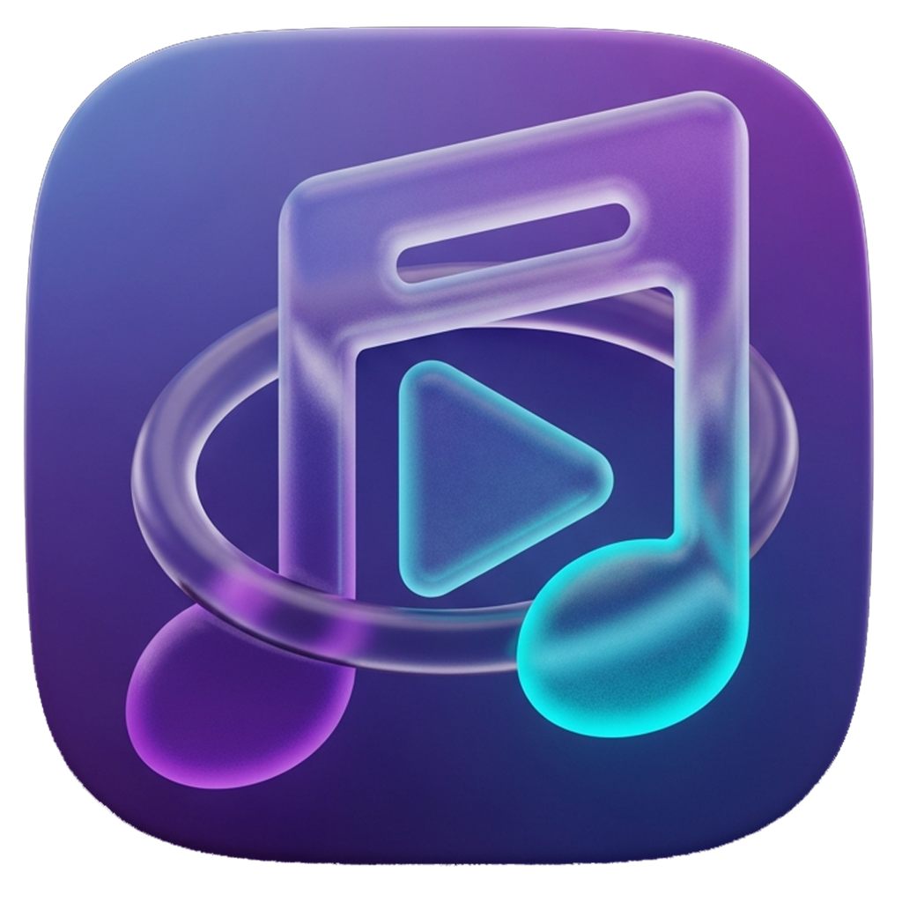

# 🎵 Video to MP3 Converter - Open Source

<div align="center">



**A Powerful, Free & Open-Source Video to MP3 Converter Built with React Native**

Transform your videos into high-quality audio files with just a few taps. Fast, simple, and privacy-focused.

[](LICENSE)
[](https://reactnative.dev/)
[](https://expo.dev/)
[](https://www.typescriptlang.org/)

[✨ Features](#-features) • [📸 Screenshots](#-screenshots) • [🛠️ Tech Stack](#️-tech-stack) • [🚀 Getting Started](#-getting-started) • [📱 Download](#-download)

</div>

---

## 📖 About

**Video to MP3 Converter** is a free, open-source mobile application that allows you to extract audio from video files with ease. Built with React Native and Expo, it provides a smooth, native experience on both Android and iOS devices.

Perfect for:
- 🎵 Creating audio files from music videos
- 🎙️ Extracting podcasts from video content
- 📚 Converting educational videos to audio for on-the-go learning
- 🎤 Saving audio from live performances

### Why This Converter?

- 🎯 **Learning Resource** - Clean React Native code with TypeScript
- 🔒 **Privacy First** - All processing done locally, no cloud uploads
- 🎨 **Modern UI** - Glass-morphism design with smooth animations
- 📦 **Zero Backend** - Fully offline, no server required
- 🆓 **100% Free** - No hidden costs, no subscriptions (lite version)
- 🔓 **Open Source** - MIT licensed, community-driven

---

## ✨ Features

### Core Features
- 🎬 **Video Selection** - Pick videos from device library or document picker
- 🎵 **MP3 Conversion** - High-quality audio extraction (up to 320kbps)
- ⚙️ **Bitrate Control** - Choose from 128kbps, 192kbps, 256kbps, or 320kbps
- 📁 **File Library** - Browse and manage all converted audio files
- ▶️ **Audio Player** - Built-in player with playback controls
- 📊 **Conversion Progress** - Real-time progress indicator with neon effects
- 💾 **Export & Share** - Save to device or share via any app
- 🎨 **Glass Morphism UI** - Modern, elegant interface with blur effects
- 🌍 **Multi-Language** - Support for multiple languages (i18n ready)
- 📱 **Responsive Design** - Works on phones and tablets

### What's NOT Included (Open Source Version)
- ❌ Batch conversion (multiple files at once)
- ❌ Cloud storage integration
- ❌ AI-powered audio enhancement
- ❌ Premium audio formats (FLAC, WAV, AAC)
- ❌ Ad-free experience (includes AdMob in production)
- ❌ Advanced tag editing

---

## 📸 Screenshots

<div align="center">
  
  
  
  
</div>

---

## 🛠️ Tech Stack

### Frontend Framework
```
React Native 0.81.5
├── Expo SDK 54
├── TypeScript 5.9
├── Expo Router 6.0 (File-based routing)
└── React 19.1.0
```

### Core Libraries
```
Audio & Video Processing
├── expo-av                    # Audio playback
├── expo-file-system          # File management
├── expo-document-picker      # Video selection
└── FFmpeg (via native module) # Audio extraction

UI Components
├── react-native-paper        # Material Design components
├── expo-linear-gradient      # Gradient effects
├── expo-blur                 # Glass-morphism blur
├── react-native-reanimated   # Smooth animations
└── @expo/vector-icons        # Icon library
```

### State Management & Storage
```
├── @react-native-async-storage/async-storage  # Local persistence
└── React Context (for global state)
```

### Monetization (Optional)
```
├── react-native-google-mobile-ads  # AdMob integration
└── react-native-purchases          # In-app purchases (RevenueCat)
```

### Developer Tools
```
├── TypeScript 5.9            # Type safety
├── Expo Dev Client           # Development builds
└── expo-build-properties     # Native build configuration
```

---

## 🎨 Design System

### Color Palette
```
Primary: #1E1E2E (Dark Blue-Gray)
Accent: #00D9FF (Neon Cyan)
Success: #00FF88 (Neon Green)
Warning: #FFD700 (Gold)
Error: #FF4444 (Red)

Background: Gradient from #0F0F1E to #1A1A2E
Glass Effect: rgba(255, 255, 255, 0.1) with backdrop blur
```

### UI Patterns
- **Glass Morphism** - Frosted glass effects with blur
- **Neon Accents** - Glowing progress bars and buttons
- **Card Layout** - Elevated cards with shadows
- **Bottom Navigation** - Glass navbar with icons

---

## 🏗️ Project Structure

```
video-to-mp3-converter/
├── app/                          # Expo Router screens
│   ├── index.tsx                # Home/Welcome screen
│   ├── convert.tsx              # Video to MP3 conversion screen
│   ├── library.tsx              # Audio library/history
│   ├── result.tsx               # Conversion result screen
│   ├── select-video.tsx         # Video picker screen
│   ├── video-detail.tsx         # Video info before conversion
│   ├── tag-editor.tsx           # Audio metadata editor
│   ├── settings.tsx             # App settings
│   ├── premium.tsx              # Premium features (IAP)
│   ├── privacy-policy.tsx       # Privacy policy screen
│   └── _layout.tsx              # Root layout with navigation
│
├── components/                   # Reusable UI components
│   ├── NavbarGlass.tsx          # Glass navigation bar
│   ├── CardGlass.tsx            # Glass card component
│   ├── ButtonPrimary.tsx        # Primary action button
│   ├── ButtonOutline.tsx        # Outline button
│   ├── ProgressNeon.tsx         # Neon progress indicator
│   ├── BitrateModal.tsx         # Bitrate selection modal
│   ├── LanguageModal.tsx        # Language picker modal
│   ├── AlertModal.tsx           # Custom alert dialog
│   └── WaveformPlaceholder.tsx  # Audio waveform visual
│
├── services/                     # Business logic services
│   ├── AdService.ts             # AdMob ad management
│   ├── IAPService.ts            # In-app purchase logic
│   └── HistoryService.ts        # Conversion history storage
│
├── modules/                      # Native modules (if any)
│   └── FFmpegModule/            # Native FFmpeg wrapper
│
├── constants/                    # App constants
│   ├── Colors.ts                # Color definitions
│   └── Config.ts                # App configuration
│
├── i18n/                         # Internationalization
│   ├── en.json                  # English translations
│   ├── id.json                  # Indonesian translations
│   └── index.ts                 # i18n setup
│
├── types.d.ts                    # TypeScript type definitions
├── index.ts                      # Entry point
├── app.config.ts                # Expo configuration
├── package.json                  # Dependencies
├── tsconfig.json                 # TypeScript config
├── .gitignore                    # Git ignore rules
├── .env.example                  # Environment template
└── README.md                     # This file
```

---

## 🚀 Getting Started

### Prerequisites

- **Node.js** >= 18.x
- **npm** or **yarn**
- **Expo CLI** - Install globally: `npm install -g expo-cli`
- **Android Studio** (for Android development) or **Xcode** (for iOS, macOS only)
- **Expo Go App** - Download from [App Store](https://apps.apple.com/app/expo-go/id982107779) or [Google Play](https://play.google.com/store/apps/details?id=host.exp.exponent)

### Installation

```bash
# 1. Clone the repository
git clone https://github.com/anggi1991/video-to-mp3-converter.git
cd video-to-mp3-converter

# 2. Install dependencies
npm install

# 3. Copy environment template (if using optional features)
cp .env.example .env
# Edit .env with your API keys if needed

# 4. Start development server
npx expo start

# 5. Scan QR code with Expo Go app
# - iOS: Open Camera app and scan QR
# - Android: Open Expo Go app and scan QR
```

### Running on Emulator/Simulator

```bash
# Android Emulator (requires Android Studio)
npx expo run:android

# iOS Simulator (macOS only, requires Xcode)
npx expo run:ios
```

### Development Build (Recommended)

For better performance and native module testing:

```bash
# Install Expo Dev Client
npx expo install expo-dev-client

# Create development build
npx expo run:android --variant debug
# or
npx expo run:ios --configuration Debug
```

---

## 📱 Building for Production

### Android (APK/AAB)

```bash
# Install EAS CLI
npm install -g eas-cli

# Login to Expo account
eas login

# Configure build
eas build:configure

# Build APK for distribution
eas build --platform android --profile production

# Build AAB for Google Play Store
eas build --platform android --profile production --type app-bundle
```

### iOS (IPA)

```bash
# Build for App Store
eas build --platform ios --profile production

# Build for TestFlight
eas build --platform ios --profile preview
```

### Local Build (Advanced)

```bash
# Android
cd android
./gradlew assembleRelease
# APK output: android/app/build/outputs/apk/release/app-release.apk

# iOS (macOS only)
cd ios
xcodebuild -workspace VideoConverter.xcworkspace -scheme VideoConverter -configuration Release
```

---

## ⚙️ Configuration

### Environment Variables

Copy `.env.example` to `.env` and configure:

```bash
# Azure OpenAI (Optional - for AI features)
EXPO_PUBLIC_AZURE_OPENAI_ENDPOINT=your_endpoint
EXPO_PUBLIC_AZURE_OPENAI_KEY=your_key

# AdMob (Optional - for monetization)
EXPO_PUBLIC_ADMOB_APP_ID_ANDROID=ca-app-pub-xxxxx
EXPO_PUBLIC_ADMOB_BANNER_ID=ca-app-pub-xxxxx/xxxxx

# RevenueCat (Optional - for IAP)
EXPO_PUBLIC_REVENUECAT_API_KEY=your_key
```

### App Configuration

Edit `app.config.ts` to customize:

```typescript
export default {
  name: "Video to MP3 Converter",
  slug: "video-mp3-converter",
  version: "1.0.0",
  // ... other settings
};
```

---

## 🎯 Usage Guide

### Converting a Video to MP3

1. **Select Video**
   - Tap "Select Video" on home screen
   - Choose from gallery or file picker
   - Preview video details

2. **Choose Settings**
   - Select audio bitrate (128-320 kbps)
   - Optionally edit metadata (title, artist)

3. **Convert**
   - Tap "Convert to MP3"
   - Wait for conversion (progress bar shows status)
   - Conversion happens locally on device

4. **Access Audio**
   - Converted file appears in Library tab
   - Play directly in app
   - Share or export to other apps

### Managing Audio Library

- **Play Audio**: Tap on any file in library
- **Share**: Long-press and select "Share"
- **Delete**: Swipe left on file
- **Sort**: Toggle sort by date/name

---

## 🧪 Testing

```bash
# Type checking
npm run tsc

# Lint code (if configured)
npm run lint

# Test on device
npx expo start --dev-client
```

---

## 🎓 Learning Resources

This project demonstrates:

- **Expo Router** - File-based navigation system
- **React Native Paper** - Material Design implementation
- **Audio Processing** - Using expo-av and FFmpeg
- **File System** - Reading/writing files with expo-file-system
- **Glass Morphism** - Modern UI design patterns
- **TypeScript** - Type-safe React Native development
- **Async Storage** - Local data persistence
- **AdMob Integration** - Mobile app monetization
- **In-App Purchases** - RevenueCat implementation

### Key Files to Study

1. **`app/convert.tsx`** - Core conversion logic
2. **`services/HistoryService.ts`** - Data persistence patterns
3. **`components/ProgressNeon.tsx`** - Custom animated component
4. **`app/_layout.tsx`** - Navigation setup with Expo Router
5. **`components/CardGlass.tsx`** - Glass morphism implementation

---

## 🤝 Contributing

Contributions are welcome! Whether it's bug fixes, new features, or documentation improvements.

### How to Contribute

1. **Fork the repository**
   - Click the "Fork" button on GitHub
   - This creates a copy under your account

2. **Clone your fork**
   ```bash
   # Replace YOUR_USERNAME with your GitHub username
   git clone https://github.com/YOUR_USERNAME/video-to-mp3-converter.git
   cd video-to-mp3-converter
   
   # Example:
   # git clone https://github.com/john-doe/video-to-mp3-converter.git
   ```

3. **Add upstream remote**
   ```bash
   git remote add upstream https://github.com/anggi1991/video-to-mp3-converter.git
   ```

4. **Create a feature branch**
   ```bash
   git checkout -b feature/amazing-feature
   ```

5. **Make your changes**
   - Write your code
   - Follow the existing code style
   - Test your changes thoroughly

6. **Commit your changes**
   ```bash
   git commit -m 'feat: add some amazing feature'
   # Use conventional commits: feat:, fix:, docs:, style:, refactor:, test:, chore:
   ```

7. **Push to your fork**
   ```bash
   git push origin feature/amazing-feature
   ```

8. **Open a Pull Request**
   - Go to the original repository
   - Click "New Pull Request"
   - Select your branch
   - Describe your changes clearly
   - Include screenshots if UI changes
   - Reference any related issues (#issue-number)
   - Wait for review and feedback

### Contribution Guidelines

- Follow TypeScript best practices
- Write meaningful commit messages (conventional commits)
- Test on both Android and iOS if possible
- Update documentation for new features
- Add comments for complex logic
- Keep PRs focused on a single feature/fix

### Ideas for Contributions

- 🎨 UI/UX improvements
- 🌍 Additional language translations
- 📱 Tablet/landscape optimizations
- 🎵 Support for more audio formats (AAC, FLAC, WAV)
- 🔄 Batch conversion feature
- ✂️ Audio trimming/editing tools
- 🎚️ Equalizer integration
- 📊 Advanced audio visualizations
- ♿ Accessibility improvements
- 🧪 Unit and integration tests

---

## 🐛 Bug Reports & Feature Requests

Found a bug or have an idea? [Open an issue](https://github.com/anggi1991/video-to-mp3-converter/issues)!

### Bug Report Template

```markdown
**Describe the bug**
A clear description of what the bug is.

**To Reproduce**
Steps to reproduce the behavior:
1. Go to '...'
2. Click on '...'
3. See error

**Expected behavior**
What you expected to happen.

**Screenshots**
If applicable, add screenshots.

**Device Info**
- Device: [e.g. Samsung Galaxy S21]
- OS: [e.g. Android 13]
- App Version: [e.g. 1.0.0]
```

---

## 📄 License

This project is licensed under the **MIT License** - see the [LICENSE](LICENSE) file for details.

### What MIT License means:
- ✅ You can use it freely for personal or commercial projects
- ✅ You can modify and distribute it
- ✅ You can use it in proprietary software
- ⚠️ You must include the original license and copyright notice

---

## 🔒 Privacy & Security

- **100% Local Processing** - Videos never leave your device
- **No Data Collection** - We don't track or store your data
- **No Account Required** - Use without registration
- **Open Source** - Audit the code yourself

### Permissions Required

- **Storage Access** - To read videos and save MP3 files
- **Media Library** - To access your video library
- **Internet** (Optional) - Only for ads and in-app purchases

---

## 🗺️ Roadmap

### Current Version (v1.0)
- ✅ Video to MP3 conversion
- ✅ Bitrate selection
- ✅ Audio library
- ✅ Built-in player
- ✅ File sharing
- ✅ Glass morphism UI

### Planned Features (v1.1)
- [ ] Batch conversion (multiple files)
- [ ] Audio trimming/cutting
- [ ] Fade in/out effects
- [ ] Volume normalization
- [ ] ID3 tag editing
- [ ] Cloud backup integration

### Future Ideas (v2.0)
- [ ] Video editing tools
- [ ] Audio effects (reverb, echo)
- [ ] Playlist creation
- [ ] Sleep timer
- [ ] Widget support
- [ ] Apple Watch companion app
- [ ] Desktop version (Electron)

---

## 📊 Project Stats

- 📦 **Dependencies**: ~25 core packages
- 📝 **Lines of Code**: ~3000+
- ✨ **Screens**: 11 (conversion, library, settings, etc.)
- 🎨 **Custom Components**: 9 reusable UI components
- 🌍 **Languages Supported**: English, Indonesian (extensible)
- 📱 **Platforms**: Android, iOS
- 🎯 **Min Android**: API 21 (Android 5.0)
- 🍎 **Min iOS**: iOS 13.0

---

## 🎯 Performance Tips

### Optimization Techniques Used

- **React.memo()** - Prevents unnecessary re-renders
- **useCallback** - Memoizes callback functions
- **Lazy Loading** - Components loaded on demand
- **Image Optimization** - Compressed assets
- **Native Modules** - FFmpeg runs natively for speed

### Best Practices

- Keep videos under 100MB for best performance
- Use 192kbps bitrate for balanced quality/size
- Clear library regularly to free up storage
- Close other apps during conversion

---

## 🔧 Troubleshooting

### Common Issues

**Issue**: Conversion fails or crashes
```
Solution: 
1. Ensure video file is not corrupted
2. Try a lower bitrate setting
3. Free up device storage (need 2x video size)
4. Restart the app
```

**Issue**: Audio quality is poor
```
Solution:
1. Select higher bitrate (256kbps or 320kbps)
2. Check source video audio quality
3. Ensure video has audio track
```

**Issue**: Can't find converted files
```
Solution:
1. Check Library tab
2. Grant storage permissions in device settings
3. Check device Downloads folder
```

**Issue**: App crashes on older devices
```
Solution:
1. Clear app cache
2. Reinstall app
3. Update to latest version
4. Device may not meet minimum requirements
```

---

## 👨‍💻 Author

**Anggi Andriyana**

- 🌐 **Portfolio**: [https://portfolio.razqashop.com/](https://portfolio.razqashop.com/)
- 💼 **LinkedIn**: [Anggi Andriyana](https://linkedin.com/in/anggi-andriyana-073a11aa)
- 🐙 **GitHub**: [@anggi1991](https://github.com/anggi1991)
- 📧 **Email**: anggiandriyana@razqashop.com
- 🐦 **Twitter**: [@anggi_razqa](https://twitter.com/anggi_razqa)

---

## 🙏 Acknowledgments

- **React Native Team** - Amazing framework
- **Expo Team** - Simplified development workflow
- **FFmpeg** - Powerful audio/video processing
- **React Native Paper** - Material Design components
- **Community Contributors** - For feedback and support

---

## 📞 Support

Need help? Here's how to reach us:

1. **Check [Documentation](https://github.com/anggi1991/video-to-mp3-converter/wiki)** - Common questions answered
2. **Search [Issues](https://github.com/anggi1991/video-to-mp3-converter/issues)** - Someone might have asked
3. **Open [Discussion](https://github.com/anggi1991/video-to-mp3-converter/discussions)** - For general questions
4. **Email Support** - anggiandriyana@razqashop.com

---

## 🎉 Show Your Support

If this project helped you:

- ⭐ **Star the repo** - Show your appreciation
- 📢 **Share it** - Tell your friends and social media
- 🤝 **Contribute** - Help make it better
- 💬 **Provide feedback** - Let us know what you think
- 🐛 **Report bugs** - Help us improve quality
- 💰 **Sponsor** - Support ongoing development

---

## 📈 Download Stats

Coming soon when published to app stores!

---

## 🌟 Featured By

- [ ] Product Hunt
- [ ] GitHub Trending
- [ ] Awesome React Native
- [ ] Reddit r/reactnative

---

<div align="center">

### Made with ❤️ and lots of ☕

**Transform videos to audio, anywhere, anytime!**

**[⬆ Back to Top](#-video-to-mp3-converter---open-source)**

</div>
